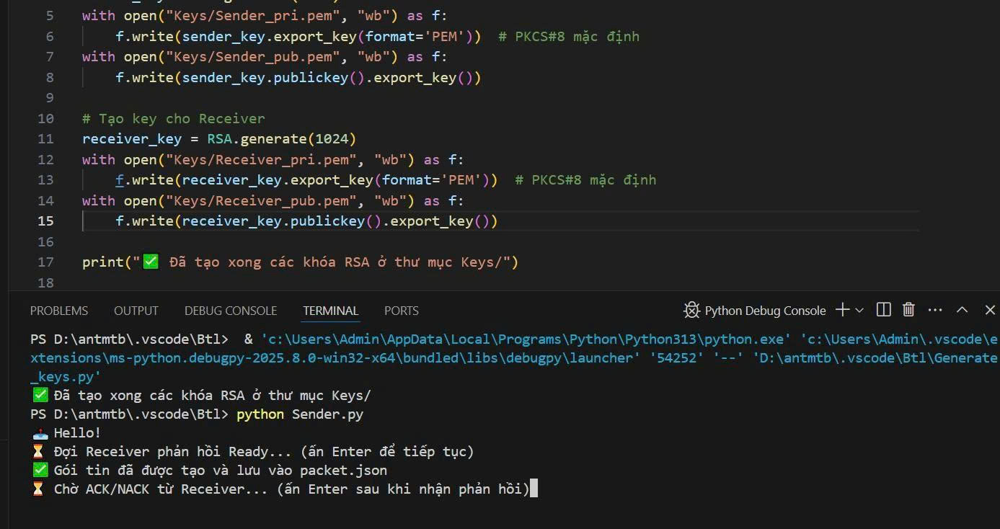
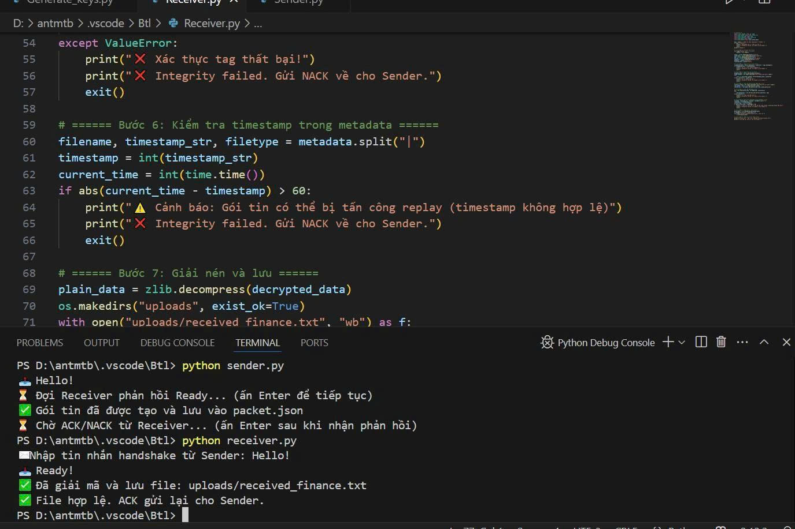
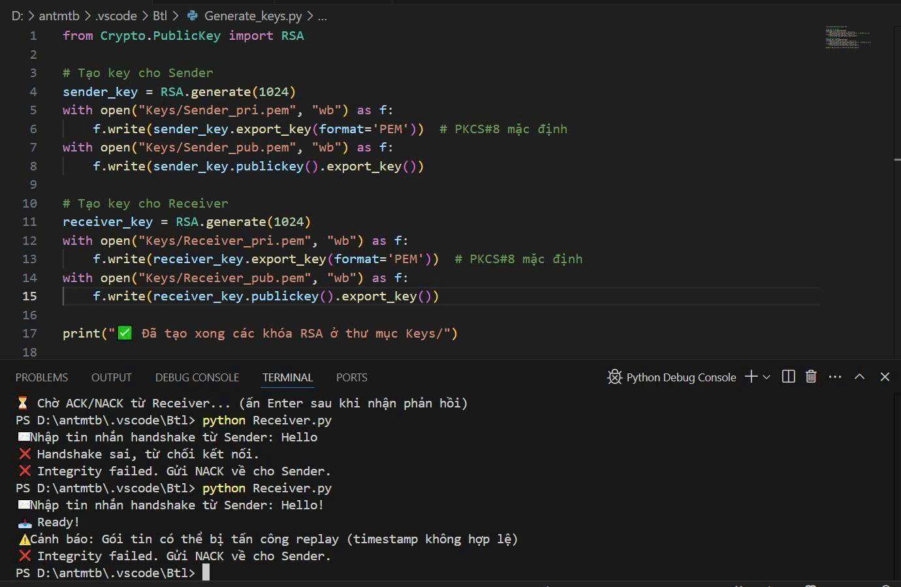

# Hệ thống chia sẻ file nội bộ an toàn – Đề tài nhóm 10: Truyền dữ liệu y tế có bảo mật

## 🌐 Giới thiệu chung
Đây là một hệ thống bảo mật cho quá trình truyền file báo cáo tài chính giữa hai bên thông qua mạng Internet. Nội dung file được nén để giảm kích thước, sau đó mã hóa bằng thuật toán AES-GCM đảm bảo tính bảo mật và toàn vẹn dữ liệu. Danh tính của người gửi và người nhận được xác thực bằng chữ ký số RSA 1024-bit, đồng thời sử dụng hàm băm SHA-512 để kiểm tra toàn vẹn nội dung file.

Hệ thống mô phỏng theo mô hình thực tế khi một tổ chức cần gửi file dữ liệu tài chính quan trọng qua mạng với yêu cầu đảm bảo bí mật – toàn vẹn – xác thực trong toàn bộ quá trình truyền tải

---

## 🔧 Công nghệ sử dụng

| Thành phần | Giải pháp |
|------------|----------|
| Nén dữ liệu | zlib |
| Mã hóa đối xứng | AES-256 GCM |
| Ký số xác thực | RSA 2048-bit |
| Kiểm tra toàn vẹn | SHA-256 |
| Giao tiếp | Giao diện dòng lệnh (CLI) |
| Quản lý khóa | Bộ khóa công khai/riêng tư (PKI) |

---
## Luồng xử lí

### 1. Handshake
- Người gửi (Sender) gửi thông điệp: "Hello!"
- Người nhận (Receiver) xác nhận bằng thông điệp "Ready!"

### 2. Ký số và trao khoá
- Người gửi ký metadata {filename | timestamp | filetype} bằng RSA + SHA-512.
- Khóa phiên (session key) dùng cho AES được mã hóa bằng khóa công khai của người nhận.

### 3. Nén, mã khoá và kiểm tra toàn vẹn
- File finance.txt được nén bằng zlib.
- Mã hóa dữ liệu nén bằng AES-GCM.
- Sinh mã hash toàn vẹn bằng SHA-512 trên nonce, ciphertext và tag.
- Gói tin bao gồm:
```json
{
  "nonce": "<Base64>",
  "cipher": "<Base64>",
  "tag": "<Base64>",
  "hash": "<SHA-512 hex>",
  "sig": "<Base64 chữ ký số>",
  "enc_key": "<Base64 khóa phiên mã hóa bằng RSA>",
  "metadata": "Input/finance.txt|<timestamp>|text/plain"
}
```

## 🚦 Quy trình hoạt động

### Bước 1: Bắt tay (Handshake)
- Sender: "Xin gửi dữ liệu!"
- Receiver: "Sẵn sàng nhận!"

### Bước 2: Chuẩn bị & ký dữ liệu
- Metadata bao gồm tên file, loại file, thời gian gửi.
- Tạo chữ ký số và mã hóa khóa phiên bằng RSA.

### Bước 3: Nén & mã hóa
- Nén file gốc bằng zlib.
- Mã hóa bằng AES-GCM với nonce sinh ngẫu nhiên.
- Sinh mã hash SHA-256 cho gói dữ liệu.

### Bước 4: Gửi gói tin
Gói JSON gửi bao gồm:

```json
{
  "cipher_data": "...",
  "nonce": "...",
  "tag": "...",
  "enc_key": "...",
  "signature": "...",
  "metadata": "...",
  "hash": "..."
}
```

### Bước 5: Nhận & xác thực
- Kiểm tra chữ ký số và mã hash.
- Giải mã khóa phiên & dữ liệu.
- Giải nén và lưu kết quả file.
- Xác minh thời gian gửi để chống lại tấn công phát lại (replay).

---

## ▶️ Hướng dẫn sử dụng

### 1. Cài đặt môi trường Python
Yêu cầu Python 3.10+
  Cài đặt thư viện cần thiết:

  ```bash
python -m pip install pycryptodome
```

### 2. Tạo khóa RSA

```bash
python create_keys.py
```

### 3. Gửi file (vai trò người gửi)

```bash
python send.py
```

> Đảm bảo file cần gửi nằm trong thư mục `data/input/`.

#### Ảnh minh họa vai trò Người gửi:


### 4. Nhận file (vai trò người nhận)

```bash
python receive.py
```

> File giải mã được lưu ở `data/output/`.

#### Ảnh minh họa vai trò Người nhận:


---
### 5. Thông báo phản hồi khi nhận file hoặc lỗi timestamp

| Trường hợp | Thông báo trên dòng lệnh | Hành động yêu cầu người dùng |
| ---------- | ------------------------ | ---------------------------- |
| Handshake thành công | 📥 Ready! | Tiếp tục nhận file |
| Handshake sai | ❌ Handshake sai, từ chối kết nối. Gửi NACK. | Chạy lại và nhập đúng "Hello!" |
| Hash mismatch | ❌ Lỗi toàn vẹn! (hash mismatch). Gửi NACK. | Kiểm tra file và thử lại |
| Chữ ký không hợp lệ | ❌ Chữ ký không hợp lệ! Gửi NACK. | Kiểm tra khóa công khai |
| Timestamp không hợp lệ (lỗi thời gian) | ⚠️ Cảnh báo: Gói tin có thể bị tấn công replay. Gửi NACK. | Chạy lại, kiểm tra đồng hồ hệ thống |
| Giải mã thành công | ✅ Đã giải mã và lưu file. Gửi ACK. | Không cần hành động thêm |
| Tag AES không khớp (sai tag) | ❌ Xác thực tag thất bại! Gửi NACK. | Kiểm tra khóa phiên đúng sai |

👉 Khi có lỗi timestamp, bạn sẽ thấy thông báo:

 ```lesh
⚠️ Cảnh báo: Gói tin có thể bị tấn công replay (timestamp không hợp lệ)
❌ Integrity failed. Gửi NACK về cho Sender.
```

## 🛠 Xử lý lỗi

| Tình huống | Hành động |
|-----------|-----------|
| Sai handshake | Gửi lại yêu cầu kết nối đúng định dạng |
| Sai chữ ký | Kiểm tra khóa công khai |
| Sai hash | Gói tin bị sửa đổi – từ chối nhận |
| Timestamp lỗi | Từ chối nhận – nghi ngờ tấn công phát lại |
| Thành công | File lưu thành công, phản hồi "ACK" |

---

## Ví dụ phản hồi ACK
)

## Ví dụ phản hồi NACK



---

## 👨‍💻 Tác giả
- Trường: Đại học Đại Nam  
- Lớp: Công nghệ thông tin 16-04
- Nguyễn Thế Vinh  
- Nhóm 10  
- Khoa: Công nghệ Thông tin  

